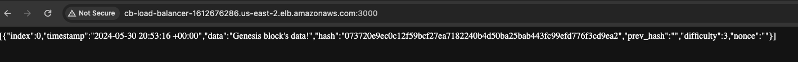

$ python3 list_vpc_info.py

<pre>
/Users/scottghome/PycharmProjects/aws_experiments/.venv/bin/python /Users/scottghome/PycharmProjects/aws_experiments/list_vpc_info.py 
VPC ID: vpc-0592298d4aa9b0c2a
CIDR Block: 172.31.0.0/16
Is Default VPC: True
Instance Tenancy: default
State: available
---
Subnet ID: subnet-0793bcfcc658a6e90
VPC ID: vpc-0592298d4aa9b0c2a
CIDR Block: 172.31.32.0/20
Availability Zone: us-east-2c
State: available
---
Subnet ID: subnet-04d936e4914f2cbc7
VPC ID: vpc-0592298d4aa9b0c2a
CIDR Block: 172.31.16.0/20
Availability Zone: us-east-2b
State: available
---
Subnet ID: subnet-0643927c232060402
VPC ID: vpc-0592298d4aa9b0c2a
CIDR Block: 172.31.0.0/20
Availability Zone: us-east-2a
State: available
---

Process finished with exit code 0

...

Terraform ECS with LB  
---------------------

scottghome@scottgs-MBP terraform % terraform show
# data.aws_availability_zones.available:
data "aws_availability_zones" "available" {
    group_names = [
        "us-east-2",
    ]
    id          = "us-east-2"
    names       = [
        "us-east-2a",
        "us-east-2b",
        "us-east-2c",
    ]
    zone_ids    = [
        "use2-az1",
        "use2-az2",
        "use2-az3",
    ]
}

# data.aws_iam_policy_document.ecs_task_execution_role:
data "aws_iam_policy_document" "ecs_task_execution_role" {
    id            = "1077804475"
    json          = jsonencode(
        {
            Statement = [
                {
                    Action    = "sts:AssumeRole"
                    Effect    = "Allow"
                    Principal = {
                        Service = "ecs-tasks.amazonaws.com"
                    }
                },
            ]
            Version   = "2012-10-17"
        }
    )
    minified_json = jsonencode(
        {
            Statement = [
                {
                    Action    = "sts:AssumeRole"
                    Effect    = "Allow"
                    Principal = {
                        Service = "ecs-tasks.amazonaws.com"
                    }
                },
            ]
            Version   = "2012-10-17"
        }
    )
    version       = "2012-10-17"

    statement {
        actions       = [
            "sts:AssumeRole",
        ]
        effect        = "Allow"
        not_actions   = []
        not_resources = []
        resources     = []
        sid           = null

        principals {
            identifiers = [
                "ecs-tasks.amazonaws.com",
            ]
            type        = "Service"
        }
    }
}

# data.template_file.cb_app:
data "template_file" "cb_app" {
    id       = "ced5b78b57cca15ac52f68a67d1abf7c6e7fabfcfb47d5338a8775a9785c62f2"
    rendered = jsonencode(
        [
            {
                cpu              = 1024
                image            = "bradfordhamilton/crystal_blockchain:latest"
                logConfiguration = {
                    logDriver = "awslogs"
                    options   = {
                        awslogs-group         = "/ecs/cb-app"
                        awslogs-region        = "us-east-2"
                        awslogs-stream-prefix = "ecs"
                    }
                }
                memory           = 2048
                name             = "cb-app"
                networkMode      = "awsvpc"
                portMappings     = [
                    {
                        containerPort = 3000
                        hostPort      = 3000
                    },
                ]
            },
        ]
    )
    template = <<-EOT
        [
          {
            "name": "cb-app",
            "image": "${app_image}",
            "cpu": ${fargate_cpu},
            "memory": ${fargate_memory},
            "networkMode": "awsvpc",
            "logConfiguration": {
                "logDriver": "awslogs",
                "options": {
                  "awslogs-group": "/ecs/cb-app",
                  "awslogs-region": "${aws_region}",
                  "awslogs-stream-prefix": "ecs"
                }
            },
            "portMappings": [
              {
                "containerPort": ${app_port},
                "hostPort": ${app_port}
              }
            ]
          }
        ]
    EOT
    vars     = {
        "app_image"      = "bradfordhamilton/crystal_blockchain:latest"
        "app_port"       = "3000"
        "aws_region"     = "us-east-2"
        "fargate_cpu"    = "1024"
        "fargate_memory" = "2048"
    }
}

# aws_alb.main:
resource "aws_alb" "main" {
    arn                                                          = "arn:aws:elasticloadbalancing:us-east-2:905418012357:loadbalancer/app/cb-load-balancer/86967f6625deecc4"
    arn_suffix                                                   = "app/cb-load-balancer/86967f6625deecc4"
    client_keep_alive                                            = 3600
    customer_owned_ipv4_pool                                     = null
    desync_mitigation_mode                                       = "defensive"
    dns_name                                                     = "cb-load-balancer-1612676286.us-east-2.elb.amazonaws.com"
    drop_invalid_header_fields                                   = false
    enable_cross_zone_load_balancing                             = true
    enable_deletion_protection                                   = false
    enable_http2                                                 = true
    enable_tls_version_and_cipher_suite_headers                  = false
    enable_waf_fail_open                                         = false
    enable_xff_client_port                                       = false
    enforce_security_group_inbound_rules_on_private_link_traffic = null
    id                                                           = "arn:aws:elasticloadbalancing:us-east-2:905418012357:loadbalancer/app/cb-load-balancer/86967f6625deecc4"
    idle_timeout                                                 = 60
    internal                                                     = false
    ip_address_type                                              = "ipv4"
    load_balancer_type                                           = "application"
    name                                                         = "cb-load-balancer"
    name_prefix                                                  = null
    preserve_host_header                                         = false
    security_groups                                              = [
        "sg-046cedad5b2df06d6",
    ]
    subnets                                                      = [
        "subnet-05567dd11ee155c57",
        "subnet-0b26d84e9dcbb588f",
    ]
    tags_all                                                     = {}
    vpc_id                                                       = "vpc-0b79ce8ba67b73629"
    xff_header_processing_mode                                   = "append"
    zone_id                                                      = "Z3AADJGX6KTTL2"

    access_logs {
        bucket  = null
        enabled = false
        prefix  = null
    }

    connection_logs {
        bucket  = null
        enabled = false
        prefix  = null
    }

    subnet_mapping {
        allocation_id        = null
        ipv6_address         = null
        outpost_id           = null
        private_ipv4_address = null
        subnet_id            = "subnet-05567dd11ee155c57"
    }
    subnet_mapping {
        allocation_id        = null
        ipv6_address         = null
        outpost_id           = null
        private_ipv4_address = null
        subnet_id            = "subnet-0b26d84e9dcbb588f"
    }
}

# aws_alb_listener.front_end:
resource "aws_alb_listener" "front_end" {
    arn               = "arn:aws:elasticloadbalancing:us-east-2:905418012357:listener/app/cb-load-balancer/86967f6625deecc4/43002ecc354ae84c"
    id                = "arn:aws:elasticloadbalancing:us-east-2:905418012357:listener/app/cb-load-balancer/86967f6625deecc4/43002ecc354ae84c"
    load_balancer_arn = "arn:aws:elasticloadbalancing:us-east-2:905418012357:loadbalancer/app/cb-load-balancer/86967f6625deecc4"
    port              = 3000
    protocol          = "HTTP"
    ssl_policy        = null
    tags_all          = {}

    default_action {
        order            = 1
        target_group_arn = "arn:aws:elasticloadbalancing:us-east-2:905418012357:targetgroup/cb-target-group/a84e3ecdcd4ed9e0"
        type             = "forward"
    }
}

# aws_alb_target_group.app:
resource "aws_alb_target_group" "app" {
    arn                                = "arn:aws:elasticloadbalancing:us-east-2:905418012357:targetgroup/cb-target-group/a84e3ecdcd4ed9e0"
    arn_suffix                         = "targetgroup/cb-target-group/a84e3ecdcd4ed9e0"
    deregistration_delay               = "300"
    id                                 = "arn:aws:elasticloadbalancing:us-east-2:905418012357:targetgroup/cb-target-group/a84e3ecdcd4ed9e0"
    ip_address_type                    = "ipv4"
    lambda_multi_value_headers_enabled = false
    load_balancer_arns                 = []
    load_balancing_algorithm_type      = "round_robin"
    load_balancing_anomaly_mitigation  = "off"
    load_balancing_cross_zone_enabled  = "use_load_balancer_configuration"
    name                               = "cb-target-group"
    name_prefix                        = null
    port                               = 80
    protocol                           = "HTTP"
    protocol_version                   = "HTTP1"
    proxy_protocol_v2                  = false
    slow_start                         = 0
    tags_all                           = {}
    target_type                        = "ip"
    vpc_id                             = "vpc-0b79ce8ba67b73629"

    health_check {
        enabled             = true
        healthy_threshold   = 3
        interval            = 30
        matcher             = "200"
        path                = "/"
        port                = "traffic-port"
        protocol            = "HTTP"
        timeout             = 3
        unhealthy_threshold = 2
    }

    stickiness {
        cookie_duration = 86400
        cookie_name     = null
        enabled         = false
        type            = "lb_cookie"
    }

    target_failover {}

    target_health_state {}
}

# aws_appautoscaling_policy.down:
resource "aws_appautoscaling_policy" "down" {
    alarm_arns         = []
    arn                = "arn:aws:autoscaling:us-east-2:905418012357:scalingPolicy:8eedf833-40e7-45af-9edc-acb10eb7523b:resource/ecs/service/cb-cluster/cb-service:policyName/cb_scale_down"
    id                 = "cb_scale_down"
    name               = "cb_scale_down"
    policy_type        = "StepScaling"
    resource_id        = "service/cb-cluster/cb-service"
    scalable_dimension = "ecs:service:DesiredCount"
    service_namespace  = "ecs"

    step_scaling_policy_configuration {
        adjustment_type          = "ChangeInCapacity"
        cooldown                 = 60
        metric_aggregation_type  = "Maximum"
        min_adjustment_magnitude = 0

        step_adjustment {
            metric_interval_lower_bound = null
            metric_interval_upper_bound = "0"
            scaling_adjustment          = -1
        }
    }
}

# aws_appautoscaling_policy.up:
resource "aws_appautoscaling_policy" "up" {
    alarm_arns         = []
    arn                = "arn:aws:autoscaling:us-east-2:905418012357:scalingPolicy:8eedf833-40e7-45af-9edc-acb10eb7523b:resource/ecs/service/cb-cluster/cb-service:policyName/cb_scale_up"
    id                 = "cb_scale_up"
    name               = "cb_scale_up"
    policy_type        = "StepScaling"
    resource_id        = "service/cb-cluster/cb-service"
    scalable_dimension = "ecs:service:DesiredCount"
    service_namespace  = "ecs"

    step_scaling_policy_configuration {
        adjustment_type          = "ChangeInCapacity"
        cooldown                 = 60
        metric_aggregation_type  = "Maximum"
        min_adjustment_magnitude = 0

        step_adjustment {
            metric_interval_lower_bound = "0"
            metric_interval_upper_bound = null
            scaling_adjustment          = 1
        }
    }
}

# aws_appautoscaling_target.target:
resource "aws_appautoscaling_target" "target" {
    arn                = "arn:aws:application-autoscaling:us-east-2:905418012357:scalable-target/0ec58eedf83340e745af9edcacb10eb7523b"
    id                 = "service/cb-cluster/cb-service"
    max_capacity       = 6
    min_capacity       = 3
    resource_id        = "service/cb-cluster/cb-service"
    role_arn           = "arn:aws:iam::905418012357:role/aws-service-role/ecs.application-autoscaling.amazonaws.com/AWSServiceRoleForApplicationAutoScaling_ECSService"
    scalable_dimension = "ecs:service:DesiredCount"
    service_namespace  = "ecs"
    tags_all           = {}
}

# aws_cloudwatch_log_group.cb_log_group:
resource "aws_cloudwatch_log_group" "cb_log_group" {
    arn               = "arn:aws:logs:us-east-2:905418012357:log-group:/ecs/cb-app"
    id                = "/ecs/cb-app"
    kms_key_id        = null
    log_group_class   = "STANDARD"
    name              = "/ecs/cb-app"
    name_prefix       = null
    retention_in_days = 30
    skip_destroy      = false
    tags              = {
        "Name" = "cb-log-group"
    }
    tags_all          = {
        "Name" = "cb-log-group"
    }
}

# aws_cloudwatch_log_stream.cb_log_stream:
resource "aws_cloudwatch_log_stream" "cb_log_stream" {
    arn            = "arn:aws:logs:us-east-2:905418012357:log-group:/ecs/cb-app:log-stream:cb-log-stream"
    id             = "cb-log-stream"
    log_group_name = "/ecs/cb-app"
    name           = "cb-log-stream"
}

# aws_cloudwatch_metric_alarm.service_cpu_high:
resource "aws_cloudwatch_metric_alarm" "service_cpu_high" {
    actions_enabled                       = true
    alarm_actions                         = [
        "arn:aws:autoscaling:us-east-2:905418012357:scalingPolicy:8eedf833-40e7-45af-9edc-acb10eb7523b:resource/ecs/service/cb-cluster/cb-service:policyName/cb_scale_up",
    ]
    alarm_description                     = null
    alarm_name                            = "cb_cpu_utilization_high"
    arn                                   = "arn:aws:cloudwatch:us-east-2:905418012357:alarm:cb_cpu_utilization_high"
    comparison_operator                   = "GreaterThanOrEqualToThreshold"
    datapoints_to_alarm                   = 0
    dimensions                            = {
        "ClusterName" = "cb-cluster"
        "ServiceName" = "cb-service"
    }
    evaluate_low_sample_count_percentiles = null
    evaluation_periods                    = 2
    extended_statistic                    = null
    id                                    = "cb_cpu_utilization_high"
    metric_name                           = "CPUUtilization"
    namespace                             = "AWS/ECS"
    period                                = 60
    statistic                             = "Average"
    tags_all                              = {}
    threshold                             = 85
    threshold_metric_id                   = null
    treat_missing_data                    = "missing"
    unit                                  = null
}

# aws_cloudwatch_metric_alarm.service_cpu_low:
resource "aws_cloudwatch_metric_alarm" "service_cpu_low" {
    actions_enabled                       = true
    alarm_actions                         = [
        "arn:aws:autoscaling:us-east-2:905418012357:scalingPolicy:8eedf833-40e7-45af-9edc-acb10eb7523b:resource/ecs/service/cb-cluster/cb-service:policyName/cb_scale_down",
    ]
    alarm_description                     = null
    alarm_name                            = "cb_cpu_utilization_low"
    arn                                   = "arn:aws:cloudwatch:us-east-2:905418012357:alarm:cb_cpu_utilization_low"
    comparison_operator                   = "LessThanOrEqualToThreshold"
    datapoints_to_alarm                   = 0
    dimensions                            = {
        "ClusterName" = "cb-cluster"
        "ServiceName" = "cb-service"
    }
    evaluate_low_sample_count_percentiles = null
    evaluation_periods                    = 2
    extended_statistic                    = null
    id                                    = "cb_cpu_utilization_low"
    metric_name                           = "CPUUtilization"
    namespace                             = "AWS/ECS"
    period                                = 60
    statistic                             = "Average"
    tags_all                              = {}
    threshold                             = 10
    threshold_metric_id                   = null
    treat_missing_data                    = "missing"
    unit                                  = null
}

# aws_ecs_cluster.main:
resource "aws_ecs_cluster" "main" {
    arn      = "arn:aws:ecs:us-east-2:905418012357:cluster/cb-cluster"
    id       = "arn:aws:ecs:us-east-2:905418012357:cluster/cb-cluster"
    name     = "cb-cluster"
    tags_all = {}

    setting {
        name  = "containerInsights"
        value = "disabled"
    }
}

# aws_ecs_service.main:
resource "aws_ecs_service" "main" {
    cluster                            = "arn:aws:ecs:us-east-2:905418012357:cluster/cb-cluster"
    deployment_maximum_percent         = 200
    deployment_minimum_healthy_percent = 100
    desired_count                      = 3
    enable_ecs_managed_tags            = false
    enable_execute_command             = false
    health_check_grace_period_seconds  = 0
    iam_role                           = "/aws-service-role/ecs.amazonaws.com/AWSServiceRoleForECS"
    id                                 = "arn:aws:ecs:us-east-2:905418012357:service/cb-cluster/cb-service"
    launch_type                        = "FARGATE"
    name                               = "cb-service"
    platform_version                   = "LATEST"
    propagate_tags                     = "NONE"
    scheduling_strategy                = "REPLICA"
    tags_all                           = {}
    task_definition                    = "arn:aws:ecs:us-east-2:905418012357:task-definition/cb-app-task:1"
    triggers                           = {}
    wait_for_steady_state              = false

    deployment_circuit_breaker {
        enable   = false
        rollback = false
    }

    deployment_controller {
        type = "ECS"
    }

    load_balancer {
        container_name   = "cb-app"
        container_port   = 3000
        elb_name         = null
        target_group_arn = "arn:aws:elasticloadbalancing:us-east-2:905418012357:targetgroup/cb-target-group/a84e3ecdcd4ed9e0"
    }

    network_configuration {
        assign_public_ip = true
        security_groups  = [
            "sg-04fbd3ad79c07cdff",
        ]
        subnets          = [
            "subnet-04ee23b71fc6ab221",
            "subnet-06730ad6346ee701b",
        ]
    }
}

# aws_ecs_task_definition.app:
resource "aws_ecs_task_definition" "app" {
    arn                      = "arn:aws:ecs:us-east-2:905418012357:task-definition/cb-app-task:1"
    arn_without_revision     = "arn:aws:ecs:us-east-2:905418012357:task-definition/cb-app-task"
    container_definitions    = jsonencode(
        [
            {
                cpu              = 1024
                environment      = []
                essential        = true
                image            = "bradfordhamilton/crystal_blockchain:latest"
                logConfiguration = {
                    logDriver = "awslogs"
                    options   = {
                        awslogs-group         = "/ecs/cb-app"
                        awslogs-region        = "us-east-2"
                        awslogs-stream-prefix = "ecs"
                    }
                }
                memory           = 2048
                mountPoints      = []
                name             = "cb-app"
                portMappings     = [
                    {
                        containerPort = 3000
                        hostPort      = 3000
                        protocol      = "tcp"
                    },
                ]
                systemControls   = []
                volumesFrom      = []
            },
        ]
    )
    cpu                      = "1024"
    execution_role_arn       = "arn:aws:iam::905418012357:role/myEcsTaskExecutionRole"
    family                   = "cb-app-task"
    id                       = "cb-app-task"
    ipc_mode                 = null
    memory                   = "2048"
    network_mode             = "awsvpc"
    pid_mode                 = null
    requires_compatibilities = [
        "FARGATE",
    ]
    revision                 = 1
    skip_destroy             = false
    tags_all                 = {}
    task_role_arn            = null
    track_latest             = false
}

# aws_eip.gw[0]:
resource "aws_eip" "gw" {
    allocation_id            = "eipalloc-0e90a13f2d33a7968"
    arn                      = "arn:aws:ec2:us-east-2:905418012357:elastic-ip/eipalloc-0e90a13f2d33a7968"
    association_id           = null
    carrier_ip               = null
    customer_owned_ip        = null
    customer_owned_ipv4_pool = null
    domain                   = "vpc"
    id                       = "eipalloc-0e90a13f2d33a7968"
    instance                 = null
    network_border_group     = "us-east-2"
    network_interface        = null
    private_ip               = null
    ptr_record               = null
    public_dns               = "ec2-13-59-37-244.us-east-2.compute.amazonaws.com"
    public_ip                = "13.59.37.244"
    public_ipv4_pool         = "amazon"
    tags_all                 = {}
    vpc                      = true
}

# aws_eip.gw[1]:
resource "aws_eip" "gw" {
    allocation_id            = "eipalloc-0b93feafabadb134a"
    arn                      = "arn:aws:ec2:us-east-2:905418012357:elastic-ip/eipalloc-0b93feafabadb134a"
    association_id           = null
    carrier_ip               = null
    customer_owned_ip        = null
    customer_owned_ipv4_pool = null
    domain                   = "vpc"
    id                       = "eipalloc-0b93feafabadb134a"
    instance                 = null
    network_border_group     = "us-east-2"
    network_interface        = null
    private_ip               = null
    ptr_record               = null
    public_dns               = "ec2-3-12-231-109.us-east-2.compute.amazonaws.com"
    public_ip                = "3.12.231.109"
    public_ipv4_pool         = "amazon"
    tags_all                 = {}
    vpc                      = true
}

# aws_iam_role.ecs_task_execution_role:
resource "aws_iam_role" "ecs_task_execution_role" {
    arn                   = "arn:aws:iam::905418012357:role/myEcsTaskExecutionRole"
    assume_role_policy    = jsonencode(
        {
            Statement = [
                {
                    Action    = "sts:AssumeRole"
                    Effect    = "Allow"
                    Principal = {
                        Service = "ecs-tasks.amazonaws.com"
                    }
                },
            ]
            Version   = "2012-10-17"
        }
    )
    create_date           = "2024-05-30T20:49:45Z"
    description           = null
    force_detach_policies = false
    id                    = "myEcsTaskExecutionRole"
    managed_policy_arns   = []
    max_session_duration  = 3600
    name                  = "myEcsTaskExecutionRole"
    name_prefix           = null
    path                  = "/"
    permissions_boundary  = null
    tags_all              = {}
    unique_id             = "AROA5FTY6O3C6BCINY2SU"
}

# aws_iam_role_policy_attachment.ecs_task_execution_role:
resource "aws_iam_role_policy_attachment" "ecs_task_execution_role" {
    id         = "myEcsTaskExecutionRole-20240530204946238900000001"
    policy_arn = "arn:aws:iam::aws:policy/service-role/AmazonECSTaskExecutionRolePolicy"
    role       = "myEcsTaskExecutionRole"
}

# aws_internet_gateway.gw:
resource "aws_internet_gateway" "gw" {
    arn      = "arn:aws:ec2:us-east-2:905418012357:internet-gateway/igw-0875dad0cf9ab9edd"
    id       = "igw-0875dad0cf9ab9edd"
    owner_id = "905418012357"
    tags_all = {}
    vpc_id   = "vpc-0b79ce8ba67b73629"
}

# aws_nat_gateway.gw[0]:
resource "aws_nat_gateway" "gw" {
    allocation_id                      = "eipalloc-0e90a13f2d33a7968"
    association_id                     = "eipassoc-00b4adf20cadd8faa"
    connectivity_type                  = "public"
    id                                 = "nat-0914e84fdc1084fda"
    network_interface_id               = "eni-02a43073c672c611b"
    private_ip                         = "172.17.2.143"
    public_ip                          = "13.59.37.244"
    secondary_private_ip_address_count = 0
    secondary_private_ip_addresses     = []
    subnet_id                          = "subnet-05567dd11ee155c57"
    tags_all                           = {}
}

# aws_nat_gateway.gw[1]:
resource "aws_nat_gateway" "gw" {
    allocation_id                      = "eipalloc-0b93feafabadb134a"
    association_id                     = "eipassoc-03ead77382ff1b6ab"
    connectivity_type                  = "public"
    id                                 = "nat-09422054b60c6e3d3"
    network_interface_id               = "eni-00dfd8591ca8eb022"
    private_ip                         = "172.17.3.124"
    public_ip                          = "3.12.231.109"
    secondary_private_ip_address_count = 0
    secondary_private_ip_addresses     = []
    subnet_id                          = "subnet-0b26d84e9dcbb588f"
    tags_all                           = {}
}

# aws_route.internet_access:
resource "aws_route" "internet_access" {
    carrier_gateway_id          = null
    core_network_arn            = null
    destination_cidr_block      = "0.0.0.0/0"
    destination_ipv6_cidr_block = null
    destination_prefix_list_id  = null
    egress_only_gateway_id      = null
    gateway_id                  = "igw-0875dad0cf9ab9edd"
    id                          = "r-rtb-06320371e0ead64fe1080289494"
    instance_id                 = null
    instance_owner_id           = null
    local_gateway_id            = null
    nat_gateway_id              = null
    network_interface_id        = null
    origin                      = "CreateRoute"
    route_table_id              = "rtb-06320371e0ead64fe"
    state                       = "active"
    transit_gateway_id          = null
    vpc_endpoint_id             = null
    vpc_peering_connection_id   = null
}

# aws_route_table.private[0]:
resource "aws_route_table" "private" {
    arn              = "arn:aws:ec2:us-east-2:905418012357:route-table/rtb-02941d73d4b45e240"
    id               = "rtb-02941d73d4b45e240"
    owner_id         = "905418012357"
    propagating_vgws = []
    route            = [
        {
            carrier_gateway_id         = null
            cidr_block                 = "0.0.0.0/0"
            core_network_arn           = null
            destination_prefix_list_id = null
            egress_only_gateway_id     = null
            gateway_id                 = null
            ipv6_cidr_block            = null
            local_gateway_id           = null
            nat_gateway_id             = "nat-0914e84fdc1084fda"
            network_interface_id       = null
            transit_gateway_id         = null
            vpc_endpoint_id            = null
            vpc_peering_connection_id  = null
        },
    ]
    tags_all         = {}
    vpc_id           = "vpc-0b79ce8ba67b73629"
}

# aws_route_table.private[1]:
resource "aws_route_table" "private" {
    arn              = "arn:aws:ec2:us-east-2:905418012357:route-table/rtb-0ca4af262ea86fb6e"
    id               = "rtb-0ca4af262ea86fb6e"
    owner_id         = "905418012357"
    propagating_vgws = []
    route            = [
        {
            carrier_gateway_id         = null
            cidr_block                 = "0.0.0.0/0"
            core_network_arn           = null
            destination_prefix_list_id = null
            egress_only_gateway_id     = null
            gateway_id                 = null
            ipv6_cidr_block            = null
            local_gateway_id           = null
            nat_gateway_id             = "nat-09422054b60c6e3d3"
            network_interface_id       = null
            transit_gateway_id         = null
            vpc_endpoint_id            = null
            vpc_peering_connection_id  = null
        },
    ]
    tags_all         = {}
    vpc_id           = "vpc-0b79ce8ba67b73629"
}

# aws_route_table_association.private[0]:
resource "aws_route_table_association" "private" {
    gateway_id     = null
    id             = "rtbassoc-0c1a9c0742fa762e6"
    route_table_id = "rtb-02941d73d4b45e240"
    subnet_id      = "subnet-04ee23b71fc6ab221"
}

# aws_route_table_association.private[1]:
resource "aws_route_table_association" "private" {
    gateway_id     = null
    id             = "rtbassoc-0867457ea378aa358"
    route_table_id = "rtb-0ca4af262ea86fb6e"
    subnet_id      = "subnet-06730ad6346ee701b"
}

# aws_security_group.ecs_tasks:
resource "aws_security_group" "ecs_tasks" {
    arn                    = "arn:aws:ec2:us-east-2:905418012357:security-group/sg-04fbd3ad79c07cdff"
    description            = "allow inbound access from the ALB only"
    egress                 = [
        {
            cidr_blocks      = [
                "0.0.0.0/0",
            ]
            description      = null
            from_port        = 0
            ipv6_cidr_blocks = []
            prefix_list_ids  = []
            protocol         = "-1"
            security_groups  = []
            self             = false
            to_port          = 0
        },
    ]
    id                     = "sg-04fbd3ad79c07cdff"
    ingress                = [
        {
            cidr_blocks      = []
            description      = null
            from_port        = 3000
            ipv6_cidr_blocks = []
            prefix_list_ids  = []
            protocol         = "tcp"
            security_groups  = [
                "sg-046cedad5b2df06d6",
            ]
            self             = false
            to_port          = 3000
        },
    ]
    name                   = "cb-ecs-tasks-security-group"
    name_prefix            = null
    owner_id               = "905418012357"
    revoke_rules_on_delete = false
    tags_all               = {}
    vpc_id                 = "vpc-0b79ce8ba67b73629"
}

# aws_security_group.lb:
resource "aws_security_group" "lb" {
    arn                    = "arn:aws:ec2:us-east-2:905418012357:security-group/sg-046cedad5b2df06d6"
    description            = "controls access to the ALB"
    egress                 = [
        {
            cidr_blocks      = [
                "0.0.0.0/0",
            ]
            description      = null
            from_port        = 0
            ipv6_cidr_blocks = []
            prefix_list_ids  = []
            protocol         = "-1"
            security_groups  = []
            self             = false
            to_port          = 0
        },
    ]
    id                     = "sg-046cedad5b2df06d6"
    ingress                = [
        {
            cidr_blocks      = [
                "0.0.0.0/0",
            ]
            description      = null
            from_port        = 3000
            ipv6_cidr_blocks = []
            prefix_list_ids  = []
            protocol         = "tcp"
            security_groups  = []
            self             = false
            to_port          = 3000
        },
    ]
    name                   = "cb-load-balancer-security-group"
    name_prefix            = null
    owner_id               = "905418012357"
    revoke_rules_on_delete = false
    tags_all               = {}
    vpc_id                 = "vpc-0b79ce8ba67b73629"
}

# aws_subnet.private[0]:
resource "aws_subnet" "private" {
    arn                                            = "arn:aws:ec2:us-east-2:905418012357:subnet/subnet-04ee23b71fc6ab221"
    assign_ipv6_address_on_creation                = false
    availability_zone                              = "us-east-2a"
    availability_zone_id                           = "use2-az1"
    cidr_block                                     = "172.17.0.0/24"
    customer_owned_ipv4_pool                       = null
    enable_dns64                                   = false
    enable_lni_at_device_index                     = 0
    enable_resource_name_dns_a_record_on_launch    = false
    enable_resource_name_dns_aaaa_record_on_launch = false
    id                                             = "subnet-04ee23b71fc6ab221"
    ipv6_cidr_block                                = null
    ipv6_cidr_block_association_id                 = null
    ipv6_native                                    = false
    map_customer_owned_ip_on_launch                = false
    map_public_ip_on_launch                        = false
    outpost_arn                                    = null
    owner_id                                       = "905418012357"
    private_dns_hostname_type_on_launch            = "ip-name"
    tags_all                                       = {}
    vpc_id                                         = "vpc-0b79ce8ba67b73629"
}

# aws_subnet.private[1]:
resource "aws_subnet" "private" {
    arn                                            = "arn:aws:ec2:us-east-2:905418012357:subnet/subnet-06730ad6346ee701b"
    assign_ipv6_address_on_creation                = false
    availability_zone                              = "us-east-2b"
    availability_zone_id                           = "use2-az2"
    cidr_block                                     = "172.17.1.0/24"
    customer_owned_ipv4_pool                       = null
    enable_dns64                                   = false
    enable_lni_at_device_index                     = 0
    enable_resource_name_dns_a_record_on_launch    = false
    enable_resource_name_dns_aaaa_record_on_launch = false
    id                                             = "subnet-06730ad6346ee701b"
    ipv6_cidr_block                                = null
    ipv6_cidr_block_association_id                 = null
    ipv6_native                                    = false
    map_customer_owned_ip_on_launch                = false
    map_public_ip_on_launch                        = false
    outpost_arn                                    = null
    owner_id                                       = "905418012357"
    private_dns_hostname_type_on_launch            = "ip-name"
    tags_all                                       = {}
    vpc_id                                         = "vpc-0b79ce8ba67b73629"
}

# aws_subnet.public[0]:
resource "aws_subnet" "public" {
    arn                                            = "arn:aws:ec2:us-east-2:905418012357:subnet/subnet-05567dd11ee155c57"
    assign_ipv6_address_on_creation                = false
    availability_zone                              = "us-east-2a"
    availability_zone_id                           = "use2-az1"
    cidr_block                                     = "172.17.2.0/24"
    customer_owned_ipv4_pool                       = null
    enable_dns64                                   = false
    enable_lni_at_device_index                     = 0
    enable_resource_name_dns_a_record_on_launch    = false
    enable_resource_name_dns_aaaa_record_on_launch = false
    id                                             = "subnet-05567dd11ee155c57"
    ipv6_cidr_block                                = null
    ipv6_cidr_block_association_id                 = null
    ipv6_native                                    = false
    map_customer_owned_ip_on_launch                = false
    map_public_ip_on_launch                        = true
    outpost_arn                                    = null
    owner_id                                       = "905418012357"
    private_dns_hostname_type_on_launch            = "ip-name"
    tags_all                                       = {}
    vpc_id                                         = "vpc-0b79ce8ba67b73629"
}

# aws_subnet.public[1]:
resource "aws_subnet" "public" {
    arn                                            = "arn:aws:ec2:us-east-2:905418012357:subnet/subnet-0b26d84e9dcbb588f"
    assign_ipv6_address_on_creation                = false
    availability_zone                              = "us-east-2b"
    availability_zone_id                           = "use2-az2"
    cidr_block                                     = "172.17.3.0/24"
    customer_owned_ipv4_pool                       = null
    enable_dns64                                   = false
    enable_lni_at_device_index                     = 0
    enable_resource_name_dns_a_record_on_launch    = false
    enable_resource_name_dns_aaaa_record_on_launch = false
    id                                             = "subnet-0b26d84e9dcbb588f"
    ipv6_cidr_block                                = null
    ipv6_cidr_block_association_id                 = null
    ipv6_native                                    = false
    map_customer_owned_ip_on_launch                = false
    map_public_ip_on_launch                        = true
    outpost_arn                                    = null
    owner_id                                       = "905418012357"
    private_dns_hostname_type_on_launch            = "ip-name"
    tags_all                                       = {}
    vpc_id                                         = "vpc-0b79ce8ba67b73629"
}

# aws_vpc.main:
resource "aws_vpc" "main" {
    arn                                  = "arn:aws:ec2:us-east-2:905418012357:vpc/vpc-0b79ce8ba67b73629"
    assign_generated_ipv6_cidr_block     = false
    cidr_block                           = "172.17.0.0/16"
    default_network_acl_id               = "acl-0502c1344cee6c506"
    default_route_table_id               = "rtb-06320371e0ead64fe"
    default_security_group_id            = "sg-0f869e7e3d271a7d2"
    dhcp_options_id                      = "dopt-0dcad057949ceed77"
    enable_dns_hostnames                 = false
    enable_dns_support                   = true
    enable_network_address_usage_metrics = false
    id                                   = "vpc-0b79ce8ba67b73629"
    instance_tenancy                     = "default"
    ipv6_association_id                  = null
    ipv6_cidr_block                      = null
    ipv6_cidr_block_network_border_group = null
    ipv6_ipam_pool_id                    = null
    ipv6_netmask_length                  = 0
    main_route_table_id                  = "rtb-06320371e0ead64fe"
    owner_id                             = "905418012357"
    tags_all                             = {}
}

Outputs:

alb_hostname = "cb-load-balancer-1612676286.us-east-2.elb.amazonaws.com"

</pre>
